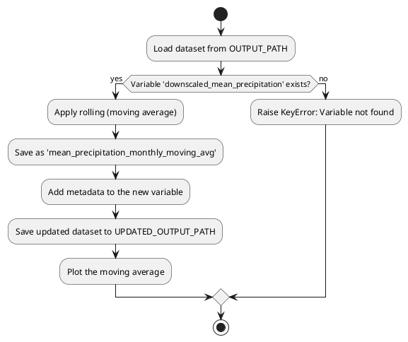

# ML Stacking Precipitation Prediction

## Elevation Map of Boyacá (90m Resolution)

This section provides tools for visualizing the elevation map of Boyacá with boundaries overlaid using a 90m resolution DEM (Digital Elevation Model).

---

### Features

- **Reusable Functions**:
    - `load_dem`: Loads the GeoTIFF file and returns the data and metadata.
    - `plot_dem_with_boundary`: Generates the elevation map with Boyacá boundaries overlaid. Optionally saves the plot if an output path is specified.

- **Entry Point**:
    - The `if __name__ == "__main__":` block ensures the script can be executed directly or imported as a module without running the main code.

- **Constants**:
    - File paths (`DEM_PATH_90` and `SHAPEFILE_BOYACA`) are defined as constants for easy modification.

- **Informative Messages**:
    - Console messages inform the user about the progress of the execution.

- **Save Option**:
    - The `plot_dem_with_boundary` function allows saving the plot to a file if an `output_path` is provided.

---

### How to Run

1. Ensure the file paths (`DEM_PATH_90` and `SHAPEFILE_BOYACA`) are correct.
2. Execute the script from the terminal:
        ```bash
        python dem-90m.py
        ```
3. The elevation map will be displayed on the screen. To save the plot, modify the call to `plot_dem_with_boundary` in the `main` function to include an `output_path`. For example:
        ```python
        plot_dem_with_boundary(
                dem_data,
                dem_meta,
                SHAPEFILE_BOYACA,
                title="Elevation Map of Boyacá (90m Resolution)",
                output_path="boyaca_elevation_map.png"
        )
        ```

---

### Example Output

The script generates a high-resolution elevation map of Boyacá with boundaries overlaid. If an output path is specified, the map is saved as an image file.

---

## Downscaling CHIRPS Data to DEM Resolution

This section describes the process of downscaling CHIRPS precipitation data to match the resolution of the DEM (90m). The script processes mean, max, and min precipitation values and combines them with elevation data.

---

### Features

- **Downscaling**:
    - The script uses `rasterio` to reproject CHIRPS data to match the DEM resolution.

- **Combined Dataset**:
    - The output dataset includes:
        - `downscaled_mean_precipitation`: Mean precipitation downscaled to DEM resolution.
        - `downscaled_max_precipitation`: Max precipitation downscaled to DEM resolution.
        - `downscaled_min_precipitation`: Min precipitation downscaled to DEM resolution.
        - `elevation`: Elevation data from the DEM.

- **Metadata**:
    - Each variable in the dataset includes descriptive metadata (e.g., units, description).

---

### How to Run

1. Ensure the input files (`boyaca_region_monthly.nc` and `dem_boyaca_90.nc`) are available in the specified paths.
2. Execute the script from the terminal:
        ```bash
        python chirps-2.0-monthly-90m.py
        ```
3. The output dataset will be saved as `ds_combined_downscaled.nc`.

---

### Example Output

The output dataset includes the following variables:
- `downscaled_mean_precipitation`: Mean precipitation downscaled to DEM resolution.
- `downscaled_max_precipitation`: Max precipitation downscaled to DEM resolution.
- `downscaled_min_precipitation`: Min precipitation downscaled to DEM resolution.
- `elevation`: Elevation data from the DEM.

---

## Monthly Moving Average of Precipitation

This section describes the process of calculating a monthly moving average for the downscaled mean precipitation.

---

### Features

- **Moving Average**:
    - The script calculates a moving average along the `time` dimension using a configurable window size (default: 3 months).

- **Updated Dataset**:
    - The output dataset includes a new variable:
        - `mean_precipitation_monthly_moving_avg`: Monthly moving average of mean precipitation.

- **Visualization**:
    - The script generates a plot of the moving average for a specific location.

---

### How to Run

1. Ensure the input dataset (`ds_combined_downscaled.nc`) is available.
2. Execute the script from the terminal:
        ```bash
        python chirps-2.0-monthly-90m-moving-avg.py
        ```
3. The updated dataset will be saved as `ds_combined_downscaled_with_monthly_moving_avg.nc`.

---

### Example Output

The updated dataset includes the following variables:
- `downscaled_mean_precipitation`: Mean precipitation downscaled to DEM resolution.
- `downscaled_max_precipitation`: Max precipitation downscaled to DEM resolution.
- `downscaled_min_precipitation`: Min precipitation downscaled to DEM resolution.
- `elevation`: Elevation data from the DEM.
- `mean_precipitation_monthly_moving_avg`: Monthly moving average of mean precipitation.

---

### Algorithm Diagram

The following diagram represents the algorithm used to calculate the monthly moving average:




---

### Notes

- Ensure all file paths are valid and accessible.
- Follow best practices for geospatial data processing and visualization.
- For additional details, refer to the inline comments in the scripts.
