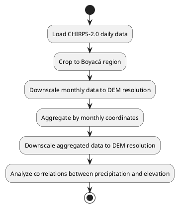
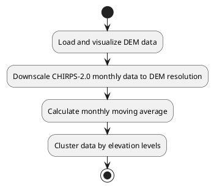

# ML Stacking Precipitation Prediction

## Elevation Map of Boyacá (90m Resolution)

This section provides tools for visualizing the elevation map of Boyacá with boundaries overlaid using a 90m resolution DEM (Digital Elevation Model).

---

### Features

- **Reusable Functions**:
    - `load_dem`: Loads the GeoTIFF file and returns the data and metadata.
    - `plot_dem_with_boundary`: Generates the elevation map with Boyacá boundaries overlaid. Optionally saves the plot if an output path is specified.

- **Entry Point**:
    - The `if __name__ == "__main__":` block ensures the script can be executed directly or imported as a module without running the main code.

- **Constants**:
    - File paths (`DEM_PATH_90` and `SHAPEFILE_BOYACA`) are defined as constants for easy modification.

- **Informative Messages**:
    - Console messages inform the user about the progress of the execution.

- **Save Option**:
    - The `plot_dem_with_boundary` function allows saving the plot to a file if an `output_path` is provided.

---

## How to Run

The project is designed to be executed through pipelines that coordinate multiple scripts to achieve specific goals. Below are the available pipelines and their descriptions.

---

### Pipeline 1: ETL for CHIRPS-2.0 and Correlation Analysis

This pipeline processes CHIRPS-2.0 precipitation data, performs downscaling, aggregation, and correlation analysis with elevation data.

#### Steps

1. Load CHIRPS-2.0 daily data and crop it to the Boyacá region.
2. Downscale CHIRPS-2.0 monthly data to match the DEM resolution (90m).
3. Aggregate the data by monthly coordinates.
4. Perform downscaling on the aggregated data to match the DEM resolution.
5. Analyze correlations between precipitation and elevation.

#### How to Run

Execute the pipeline script from the terminal:

```bash
python process/run_pipeline_etl_chirps-2.0_and_correlation_monthly_and_coordiante.py
```

#### Diagram




---

### Pipeline 2: ETL for DEM and CHIRPS-2.0 Integration

This pipeline processes DEM and CHIRPS-2.0 data, visualizes the elevation map, and integrates precipitation data with elevation.

#### Steps

1. Load and visualize the DEM data for Boyacá.
2. Downscale CHIRPS-2.0 monthly data to match the DEM resolution.
3. Calculate a monthly moving average for the downscaled precipitation data.
4. Cluster the data by elevation levels (low, medium, high).

#### How to Run

Execute the pipeline script from the terminal:

```bash
python process/run_pipeline_etl.py
```

#### Diagram




---

### Notes

- Ensure all file paths are valid and accessible before running the pipelines.
- Follow best practices for geospatial data processing and visualization.
- For additional details, refer to the inline comments in the scripts.
