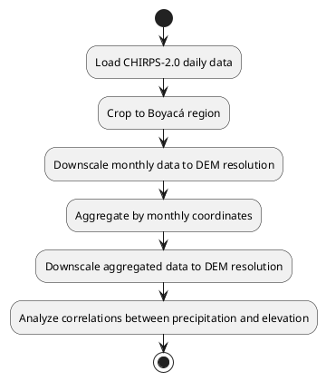
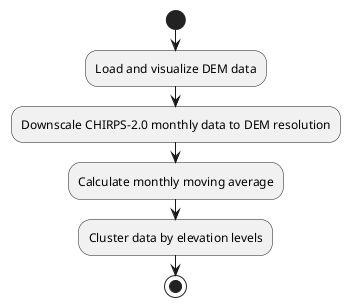

# ML Stacking Precipitation Prediction

## Elevation Map of Boyacá (90m Resolution)

This section provides tools for visualizing the elevation map of Boyacá with boundaries overlaid using a 90m resolution DEM (Digital Elevation Model).

---

### Features

- **Reusable Functions**:
    - `load_dem`: Loads the GeoTIFF file and returns the data and metadata.
    - `plot_dem_with_boundary`: Generates the elevation map with Boyacá boundaries overlaid. Optionally saves the plot if an output path is specified.

- **Entry Point**:
    - The `if __name__ == "__main__":` block ensures the script can be executed directly or imported as a module without running the main code.

- **Constants**:
    - File paths (`DEM_PATH_90` and `SHAPEFILE_BOYACA`) are defined as constants for easy modification.

- **Informative Messages**:
    - Console messages inform the user about the progress of the execution.

- **Save Option**:
    - The `plot_dem_with_boundary` function allows saving the plot to a file if an `output_path` is provided.

---

## How to Run

The project is designed to be executed through pipelines that coordinate multiple scripts to achieve specific goals. Below are the available pipelines and their descriptions.

---

### Pipeline 1: ETL for CHIRPS-2.0 and Correlation Analysis

This pipeline processes CHIRPS-2.0 precipitation data, performs downscaling, aggregation, and correlation analysis with elevation data.

#### Steps

1. Load CHIRPS-2.0 daily data and crop it to the Boyacá region.
2. Downscale CHIRPS-2.0 monthly data to match the DEM resolution (90m).
3. Aggregate the data by monthly coordinates.
4. Perform downscaling on the aggregated data to match the DEM resolution.
5. Analyze correlations between precipitation and elevation.

#### How to Run

Execute the pipeline script from the terminal:

```bash
python process/run_pipeline_etl_chirps-2.0_and_correlation_monthly_and_coordiante.py
```

#### Diagram




---

### Pipeline 2: ETL for DEM and CHIRPS-2.0 Integration

This pipeline processes DEM and CHIRPS-2.0 data, visualizes the elevation map, and integrates precipitation data with elevation.

#### Steps

1. Load and visualize the DEM data for Boyacá.
2. Downscale CHIRPS-2.0 monthly data to match the DEM resolution.
3. Calculate a monthly moving average for the downscaled precipitation data.
4. Cluster the data by elevation levels (low, medium, high).

#### How to Run

Execute the pipeline script from the terminal:

```bash
python process/run_pipeline_etl.py
```

#### Diagram




---

## Existing Processes

This section describes the main processes implemented in the project and their purposes.

| Process | Script | Objective | Description |
|---------|--------|-----------|-------------|
| 1. Data Loading | `process/1_load.py` | Load CHIRPS-2.0 precipitation and DEM elevation data | This process loads raw CHIRPS-2.0 data in NetCDF format and elevation data in GeoTIFF format, performing initial validation and preparing them for further processing. |
| 2. Monthly Transformation and Aggregation | `process/2_transformation_monthly_aggregations.py` | Aggregate daily precipitation data at monthly scale | Transforms CHIRPS-2.0 daily data into monthly aggregations, calculating total, maximum, and minimum values for each month. |
| 3. Merging with DEM | `process/3_merge_dem_months_aggregation.py` | Integrate precipitation data with elevation data | Combines monthly precipitation data with DEM elevation data, ensuring proper spatial alignment. |
| 4. Correlation Analysis | `process/4_correlation_dem_months_aggregation.py` | Analyze correlations between precipitation and elevation | Calculates and visualizes correlations between different precipitation variables and elevation over time. |
| 5. CHIRPS Downscaling to 90m | `data/transformation/downscaling/chirps-2.0-monthly-90m.py` | Increase spatial resolution of CHIRPS data | Performs downscaling of CHIRPS data from 0.05°×0.05° (approximately 5km) to 90m resolution to align with the DEM. |
| 6. Coordinate Aggregation | `data/transformation/downscaling/chirps-2.0-monthly-coordinates-aggregation-90m.py` | Aggregate data by specific geographic coordinates | Aggregates monthly data by coordinates and then performs downscaling to 90m for detailed spatial analysis. |
| 7. Elevation Clustering | `data/transformation/clustering/chirps-2.0.py` | Segment data by elevation ranges | Classifies precipitation data into groups based on elevation ranges (low, medium, high). |

---

## Generated NetCDF Files

This section describes the NetCDF (.nc) files generated at different stages of processing and their purposes.

### Input Data Files

| File Name | Path | Resolution | Variables | Purpose |
|-----------|------|------------|-----------|---------|
| CHIRPS-2.0-daily.nc | `/data/load/CHIRPS-2.0-daily.nc` | 0.05° × 0.05° (~5km) | precipitation, lat, lon, time | Provide daily precipitation data for the entire study region |
| dem_boyaca_90.nc | `/data/output/dem_boyaca_90.nc` | 90m | elevation, lat, lon | Provide high-resolution elevation data for the Boyacá region |

### Intermediate Processed Files

| File Name | Path | Resolution | Variables | Purpose |
|-----------|------|------------|-----------|---------|
| boyaca_region.nc | `/data/output/boyaca_region.nc` | 0.05° × 0.05° (~5km) | precipitation, lat, lon, time | CHIRPS data clipped to the Boyacá region |
| boyaca_region_monthly_sum.nc | `/data/output/boyaca_region_monthly_sum.nc` | 0.05° × 0.05° (~5km) | monthly_precipitation, lat, lon, time | Monthly sum of precipitation for the Boyacá region |
| boyaca_region_monthly_aggregated.nc | `/data/output/boyaca_region_monthly_aggregated.nc` | 0.05° × 0.05° (~5km) | total_precipitation, max_daily_precipitation, min_daily_precipitation, lat, lon, time | Monthly data aggregated by geographic coordinates |

### Final Processed Files

| File Name | Path | Resolution | Variables | Purpose |
|-----------|------|------------|-----------|---------|
| boyaca_region_monthly_coordinates_aggregation_downscaled_90m.nc | `/data/output/boyaca_region_monthly_coordinates_aggregation_downscaled_90m.nc` | 90m | total_precipitation_downscaled, max_daily_precipitation_downscaled, min_daily_precipitation_downscaled, elevation | Monthly precipitation data with improved resolution to 90m |
| boyaca_region_months_aggregated_avg_merged_dem.nc | `/data/output/boyaca_region_months_aggregated_avg_merged_dem.nc` | Variable (multiple resolutions) | monthly_precipitation, elevation, lat, lon, time | Integration of precipitation data with elevation for joint analysis |
| boyaca_region_months_aggregated_avg_cluster_low.nc, boyaca_region_months_aggregated_avg_cluster_medium.nc, boyaca_region_months_aggregated_avg_cluster_high.nc | Low: `/data/output/boyaca_region_months_aggregated_avg_cluster_low.nc`<br>Medium: `/data/output/boyaca_region_months_aggregated_avg_cluster_medium.nc`<br>High: `/data/output/boyaca_region_months_aggregated_avg_cluster_high.nc` | Variable (multiple resolutions) | monthly_precipitation, elevation, cluster_id, lat, lon, time | Precipitation data segmented by elevation ranges |

### Model Files

| File Name | Path | Type | Resolution | Variables | Purpose |
|-----------|------|------|------------|-----------|---------|
| boyaca_region_monthly_coordinates_aggregation_downscaled_90m.nc | `/data/output/boyaca_region_monthly_coordinates_aggregation_downscaled_90m.nc` | Input | 90m | total_precipitation_downscaled, max_daily_precipitation_downscaled, min_daily_precipitation_downscaled, elevation, lat, lon, time | Input dataset for ConvLSTM model training with high-resolution precipitation and elevation data |
| boyaca_region_months_aggregated_avg_merged_dem.nc | `/data/output/boyaca_region_months_aggregated_avg_merged_dem.nc` | Input | Variable | monthly_precipitation, elevation, lat, lon, time | Input dataset for model training with integrated precipitation and elevation data |
| boyaca_region_months_aggregated_avg_cluster_low.nc | `/data/output/boyaca_region_months_aggregated_avg_cluster_low.nc` | Input | Variable | monthly_precipitation, elevation, cluster_id, lat, lon, time | Input dataset for low elevation areas model training |
| boyaca_region_months_aggregated_avg_cluster_medium.nc | `/data/output/boyaca_region_months_aggregated_avg_cluster_medium.nc` | Input | Variable | monthly_precipitation, elevation, cluster_id, lat, lon, time | Input dataset for medium elevation areas model training |
| boyaca_region_months_aggregated_avg_cluster_high.nc | `/data/output/boyaca_region_months_aggregated_avg_cluster_high.nc` | Input | Variable | monthly_precipitation, elevation, cluster_id, lat, lon, time | Input dataset for high elevation areas model training |
| conv_lstm_model_baseline.h5 | `/notebooks/conv_lstm_model_baseline.h5` | Model | N/A | N/A | Baseline ConvLSTM model weights for precipitation prediction |
| conv_lstm_model_final.h5 | `/notebooks/conv_lstm_model_final.h5` | Model | N/A | N/A | Optimized ConvLSTM model weights for final precipitation prediction |
| predicted_precip_monthly.nc | `/data/output/predicted_precip_monthly.nc` | Output | 0.05° × 0.05° (~5km) | predicted_precipitation, lat, lon, time | Monthly precipitation predictions generated by the ConvLSTM model |
| predicted_precip_12months.nc | `/data/output/predicted_precip_12months.nc` | Output | 0.05° × 0.05° (~5km) | predicted_precipitation, forecast_month, lat, lon, time | 12-month precipitation forecast predictions generated by the ConvLSTM model |

---

### Notes

- All NetCDF files contain additional metadata about projection, units, and generation process.
- Intermediate files are preserved to allow analysis at different stages of processing.
- Most final files include both precipitation and elevation data to facilitate integrated analyses.
- Model output files are generated from the notebooks using ConvLSTM deep learning models trained on the processed data.
- **Note**: The base path for all files is `/data/output/`

---

## Logging System

The project uses a custom logging system to facilitate script execution tracking and debugging. This system is implemented in the `utils/custom_logger.py` module.

### Logging System Features

- **Daily Logs**: Generates log files with date-based naming (`log-YYYY-MM-DD.log`).
- **Dual Output**: Displays messages both in console and log files.
- **Custom Format**: Includes information about file path, function, line, and log level.
- **Relative Paths**: Shows file paths relative to the project root directory.
- **Specialized Loggers**: Includes a specific logger for pipelines to facilitate tracking of long-running processes.

### How to Use the Logger

To use the logging system in a new script:

```python
# Import the logging module
import sys
import os

# Add the root directory to the path to import custom modules
sys.path.append(os.path.join(os.path.dirname(__file__), "../"))
from utils.custom_logger import get_logger

# Logger configuration
logger = get_logger(__name__)

# Using the logger
logger.info("Starting process...")
logger.warning("Warning: file not found")
logger.error("Error in function X")
```

For long processing pipelines, use the specialized logger:

```python
from utils.custom_logger import get_pipeline_logger

# Create a logger for a specific pipeline
logger = get_pipeline_logger(__name__, "pipeline-etl-chirps")

# The pipeline ID will be automatically added to messages
logger.info("Starting pipeline...")
```

### Location of Logs

Log files are saved at:
- General logs: `/logs/log-YYYY-MM-DD.log`
- Data logs: `/data/logs/log-YYYY-MM-DD.log`

---

### Notes

- Ensure all file paths are valid and accessible before running the pipelines.
- Follow best practices for geospatial data processing and visualization.
- For additional details, refer to the inline comments in the scripts.
